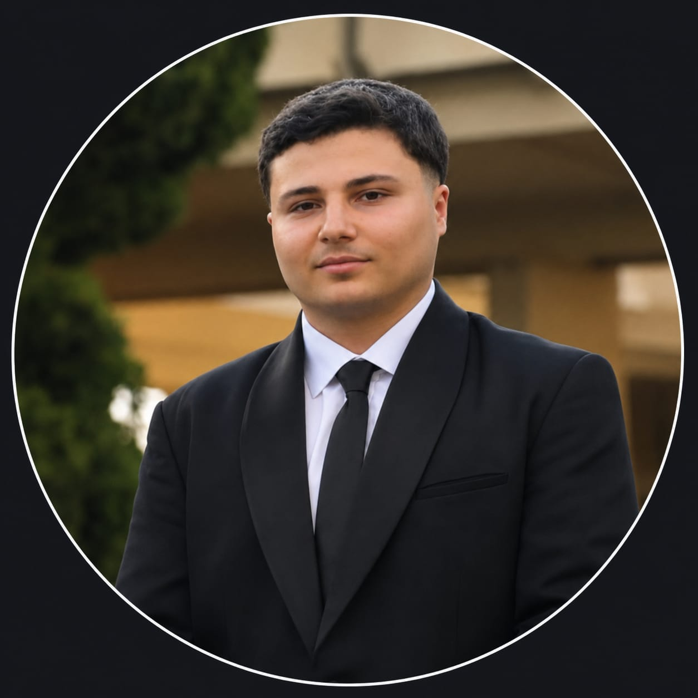

<h1 align="center">Mohamad Badra</h1>

<b>B.Sc. Mathematics (Data Science) — Saint Joseph University of Beirut</b> 
Applied Machine Learning · Neuroimaging · NLP · Customer Analytics

---

I'm a data science graduate building end-to-end ML pipelines — from raw
data (fMRI scans, tweets, transaction logs) to evaluated models to deployed apps. My
final-year project used machine learning on resting-state fMRI to classify Parkinson's
disease; outside of that I work across NLP and marketing/customer analytics. I'm applying
to Master of Data Science programs in Australia for 2027 entry and am looking for
research-adjacent, hands-on programs where I can keep working this way.

Every project below follows the same standard: a documented pipeline, leakage-safe
evaluation, a written report, and reproducible code — not just a notebook that ran once.

## Featured project

### 🧠 [Parkinson's Disease Classification from Resting-State fMRI](https://github.com/MohamadBadra20/Parkinson-s-Disease-Prediction-using-MRI-Images-and-Machine-Learning) — Final Year Project

End-to-end pipeline from raw BIDS fMRI data to a deployed diagnostic web app.
fMRIPrep preprocessing → AAL-116 atlas ROI extraction → functional connectivity
(6,670 features/subject) → 10 classifiers compared under a leakage-safe CV pipeline →
soft-voting ensemble → Flask deployment with PDF reporting.

**Recall = 1.00, F1 = 0.875 (SVM-linear)** on held-out test set · validated with 50-fold
repeated CV (F1 = 0.757 ± 0.123) so the headline number isn't a lucky split.

`Python` `Nilearn` `fMRIPrep` `scikit-learn` `imbalanced-learn` `Flask` `Docker`

---

## Other projects, by domain

<table>
<tr>
<td width="33%" valign="top">

**🗣️ NLP**
### [CyberShield](https://github.com/MohamadBadra20/Cybershield-Cyberbullying-Detection)
6-class cyberbullying detection on ~47.7k tweets. TF-IDF baselines vs. fine-tuned
RoBERTa, SHAP/LIME explainability, FastAPI + web demo.

**85.0% accuracy** / 0.844 weighted F1 (RoBERTa) vs. 82.2% / 0.822 (best classical)

`RoBERTa` `TF-IDF` `SHAP/LIME` `FastAPI`

</td>
<td width="33%" valign="top">

**📊 Customer Analytics**
### [CLV Analytics](https://github.com/MohamadBadra20/Customer-Lifetime-Value-Analytics)
1M+ e-commerce transactions → RFM + BG/NBD & Gamma-Gamma CLV modeling → K-Means
segmentation → value-tier classification → Apriori market-basket rules.

**81.0% accuracy** (Random Forest, tuned), 4-class value tiers · silhouette = 0.53 clustering

`BG/NBD` `Gamma-Gamma` `K-Means` `Apriori`

</td>
<td width="33%" valign="top">

**📈 Classification / Data Mining**
### [Bank Marketing Prediction](https://github.com/MohamadBadra20/Bank-Marketing-Prediction)
Term-deposit subscription prediction on the UCI Bank Marketing dataset. VIF +
ANOVA feature selection, SMOTETomek vs. NearMiss under 7.1:1 class imbalance.

**86–88% accuracy**, 0.56–0.67 recall (SMOTETomek, 5 models compared)

`scikit-learn` `imbalanced-learn` `XGBoost`

</td>
</tr>
</table>

## Skills

| | |
|---|---|
| **Languages** | Python, SQL |
| **ML / Stats** | scikit-learn, XGBoost, LightGBM, imbalanced-learn, statsmodels |
| **Deep Learning / NLP** | PyTorch, HuggingFace Transformers (RoBERTa), SHAP, LIME |
| **Neuroimaging** | fMRIPrep, Nilearn, ANTs, BIDS |
| **Deployment** | Flask, FastAPI, Docker |
| **Tools** | Jupyter, Git/GitHub, pandas, matplotlib/seaborn |

## Education

**B.Sc. Mathematics — Data Science**, Saint Joseph University of Beirut (USJ) · GPA 3.7/4 · Dean's Honor List (S4, S5, S6)
Final Year Project: *Parkinson's Disease Classification from Resting-State fMRI*,
supervised by Dr. Michel Abboud

---

<i>Full write-ups, figures, and reports are in each repo — start with the pinned Parkinson's project.</i>

